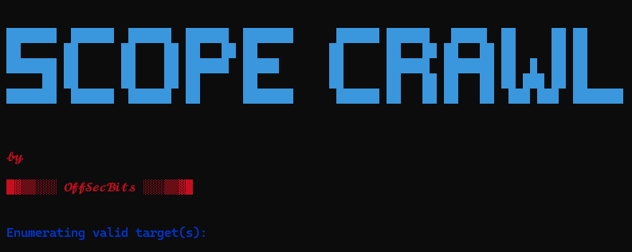

# scopecrawl

**scopecrawl** is a powerful, easy-to-use CLI tool for **in-scope** web crawling, URL validation, and link extraction. Written in Go, **scopecrawl** helps you validate URLs, remove duplicates, and extract valuable links from web pages. This tool is ideal for security professionals, web developers, and anyone in need of efficient URL analysis and crawling.

## Features

- **Single URL**: Quickly extract all in-scope domain links from html page.
- **Batch URL**: Quickly extract list of in-scope domains links from respective html pages.
- **Active Crawling**: Crawls website recursively extracting valuble links, with depth and request rate limits.
- **Output support**: Export results in plain text or JSON format into respective files.

---  

## Installation

### Prerequisites

Ensure you have Go installed on your system. If not, [install Go](https://golang.org/doc/install).

### Install `scopecrawl`

To install `scopecrawl`, use the following command:

```bash
go install github.com/offsecbits/scopecrawl@latest
```
---

### Examples

**1. Single URL**
```bash
scopecrawl -u example.com
```
**2. File with list of URLs**
```bash
scopecrawl -f <file_path>
```
**3. Active  recursive scans with depth and ratelimit**
```bash
scopecrawl -f <file_path> -d 2 -r 3 -t 2 -o txt
```


### **Read [Documentation](./Documentation.md) for detailed information.**

---

### **License**

This project is licensed under the [MIT license](LICENSE).

---

### **Contact**

Author: Rajashekar Nayini

Email: offsecbits@gmail.com

GitHub: https://github.com/offsecbits

LinkedIn: https://www.linkedin.com/in/rajashekarreddy-nayini/

---

## **Next Steps**
* Add **active\recursive** scanning capabilities.
* Add rate limiting to control **req/sec** and **concurent threads**.
* Add **filters** on end results to match end users requirments.
---


